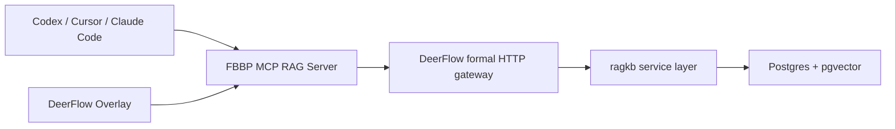

# FBBP MCP RAG Server for Coding Agents and AI IDEs

An MCP-compatible retrieval server that exposes your private FBBP knowledge base to agents and AI IDEs, built as a thin formal knowledge service layer on top of `ragkb`.

## What This Repo Does
- Exposes `ragkb` retrieval and ingest operations as MCP tools
- Lets DeerFlow, Codex, Cursor, or Claude Code call your private knowledge base through MCP
- Reuses your existing `llm-rag-knowledge-base` instead of creating a second RAG stack

## Formal Snapshot Contract

The real FBBP formal runtime now reads its checked-in JSONL snapshot from this repo instead of reading runtime data files directly out of `llm-rag-knowledge-base`.

- active snapshot root: `formal_snapshots/fbbp_private_v2026_04/`
- runtime descriptor: `configs/datasets/fbbp_private_v2026_04.json`
- snapshot manifest: `formal_snapshots/fbbp_private_v2026_04/MANIFEST.json`

Use this command when you explicitly want to refresh the checked-in snapshot from the canonical upstream RAG-ready exports:

```powershell
scripts\sync_formal_snapshot.ps1
```

Preview the sync plan without copying files:

```powershell
scripts\sync_formal_snapshot.ps1 -PreviewOnly
```

`scripts\rebuild_fbbp_formal_db.ps1` now rebuilds from the repo-local formal snapshot. It no longer depends on reading JSONL files out of the sibling RAG repo at runtime.

## Tools Exposed

### Runtime and Contract
- `server_status` - basic runtime and shared RAG configuration checks
- `health_status` - runtime, database, and public scientific lookup diagnostics
- `tool_contract_version` - return the current formal MCP tool contract version

### Private Knowledge Access
- `list_sources` - list indexed sources and chunk counts
- `list_record_types` - aggregate available record types in the shared knowledge base
- `get_source_summary` - summarize one source across record types and chunk counts
- `get_document_chunk` - fetch a specific indexed chunk by `source + chunk_id`
- `search_knowledge` - semantic retrieval with optional structured filters and answer synthesis
- `explain_search` - return normalized search parameters plus retrieval summary
- `preview_ingest` - inspect a candidate ingest path without mutating the database
- `ingest_sources` - ingest local files into the shared FBBP vector store

### Public Scientific Lookups
- `search_pubmed` - search PubMed and return compact article summaries
- `get_uniprot_entry` - fetch a compact UniProtKB entry by accession
- `get_pdb_entry` - fetch a compact RCSB PDB entry by identifier

## Design Choice
This repo intentionally stays thin:
- `ragkb` remains the knowledge engine
- this server only provides MCP-compatible tool access
- DeerFlow and other agents consume the tools without duplicating ingestion or retrieval logic
- external scientific lookups stay lightweight and call public REST APIs directly

## Formal Search Execution Model

`search_knowledge` on the MCP HTTP server now uses a single formal execution path on this machine:

```text
Codex / MCP client
  -> fbbp-mcp-rag-server search_knowledge
  -> DeerFlow formal Python gateway (/api/fbbp/formal-search on :8001)
  -> in-process fbbp_mcp_server.service.search_knowledge
  -> ragkb / PostgreSQL
```

This removes the old Next.js API + script hop from the formal path and keeps the stable execution surface in one always-on backend process.

Environment knobs:

- `FBBP_FORMAL_QUERY_GATEWAY_URL`
- `FBBP_FORMAL_QUERY_GATEWAY_TIMEOUT_SECONDS`
- `FBBP_FORMAL_DEFAULT_ANSWER_MODE`
Legacy lowercase `fbtp`-prefixed environment aliases are still accepted internally for backward compatibility, but all public deployment examples should use the `FBBP_*` names above.

Expected diagnostics for MCP `search_knowledge`:

- `query_transport = formal_http_gateway`
- `gateway_url`
- `gateway_backend_transport`

The live formal path now defaults to `answer_mode = formal` whenever a grounded answer is requested. That mode uses multi-query fusion over the real FBBP database and emits deterministic structured output:

- `summary`
- `claims`
- `key_findings`
- `known_unknowns`
- `evidence_rows`
- `evidence_table`
- `source_registry_used`

## Formal Gateway Status

The DeerFlow backend now exposes a production status surface for the live FBBP stack:

- `GET http://127.0.0.1:8001/api/fbbp/status`
- `POST http://127.0.0.1:8001/api/fbbp/formal-search`
- `POST http://127.0.0.1:8001/api/fbbp/canary`

The status payload includes:

- startup `warmup` timing for embeddings / routing / reranker / LLM
- startup `canary` result against the real FBBP database
- MCP HTTP reachability
- the active `dataset_version`, `runtime_profile`, `formal_db_mode`, `db_identity`, and `source_registry_version`

## Formal Contract

The server is moving toward a formal, provenance-aware response contract for every tool. Each tool response follows the same top-level shape:

```json
{
  "ok": true,
  "tool": "search_knowledge",
  "contract_version": "1.0",
  "request": {},
  "result": {},
  "provenance": {},
  "diagnostics": {},
  "error": null
}
```

See [docs/formal_tool_contract.md](docs/formal_tool_contract.md) for the detailed contract and the intended DeerFlow usage order.

Formal runtime metadata can also be supplied through:

- `FBBP_FORMAL_DATASET_VERSION`
- `FBBP_FORMAL_RUNTIME_PROFILE`
Legacy lowercase `fbtp`-prefixed aliases are still accepted internally for older local scripts.

Checked-in descriptor examples live under:

- `configs/datasets/`
- `configs/runtime/`
- `formal_snapshots/`

## Architecture


## Quick Start

### 1) Create a dedicated environment
```bash
cd fbbp-mcp-rag-server
powershell -ExecutionPolicy Bypass -File scripts/bootstrap_local_env.ps1
```

This creates `.venv` and installs both editable packages:
- `../llm-rag-knowledge-base`
- `./fbbp-mcp-rag-server` as the portfolio package name (`./fbbp-mcp-rag-server` remains the current repo path)

### 2) Configure database / model environment
You can reuse the same environment variables as `llm-rag-knowledge-base`:
- `PGHOST`
- `PGPORT`
- `PGDATABASE`
- `PGUSER`
- `PGPASSWORD`
- `PGTABLE`
- `EMBEDDING_PROVIDER`
- `ANSWER_MODE`

Optional:
- `RAGKB_SRC_PATH` - override the sibling `ragkb` source path
- `FBBP_MCP_DEFAULT_TOP_K` - default retrieval size
- `FBBP_MCP_DEFAULT_ANSWER_MODE` - default answer mode used by `search_knowledge`
- Legacy lowercase `fbtp`-prefixed defaults are still accepted internally for compatibility with older local scripts.

### 3) Run the server

#### stdio mode
```bash
python server.py
```

#### streamable HTTP mode
```bash
python server.py --transport streamable-http --host 127.0.0.1 --port 8000
```

The root `server.py` also checks the repo-local `.venv` site-packages, so it still works after workspace moves where the old venv launcher path becomes stale.

## Stable Windows Local Workflow

When the repo-local `.venv\Scripts\python.exe` launcher becomes stale after moving the workspace between machines or drive letters, the recommended Windows local path is to use the system `python` with `-S` and let the repo bootstrap its own `site-packages`.

### Localhost 5432 Self-Heal

The stable local smoke path now treats PostgreSQL readiness as a real query check instead of only checking whether `localhost:5432` has an open TCP listener.

On this machine, a stale Windows `portproxy` entry on `127.0.0.1:5432` could make the port look open while also blocking the WSL PostgreSQL cluster from binding the same port. The one-command smoke path now fixes that automatically:

- removes legacy local `portproxy` entries on `127.0.0.1:5432`
- starts the WSL PostgreSQL cluster if needed
- ensures the formal `ragkb` database and `vector` extension exist
- waits until `SELECT 1` succeeds on `localhost:5432`

Manual probe command:

```powershell
powershell -NoProfile -ExecutionPolicy Bypass -File .\scripts\ensure_local_formal_pg_ready.ps1
```

### One-Command Rerun

If you want a fresh local smoke run and automatic teardown in one command:

```powershell
scripts\run_local_smoke_once.cmd
```

What it does:

- prefers WSL PostgreSQL by default
- only uses Windows PostgreSQL when you explicitly opt in
- self-heals stale `localhost:5432` portproxy state before starting WSL PostgreSQL
- treats readiness as a real SQL query instead of a port-open check
- launches the MCP HTTP server
- runs the local smoke checks
- emits one structured JSON payload with `ensure_pg` and `smoke`
- stops the temporary PostgreSQL / MCP processes before exit

If you only want to inspect the derived plan without starting anything:

```powershell
scripts\run_local_smoke_once.cmd -PlanOnly
```

If you explicitly want to try Windows PostgreSQL first:

```powershell
scripts\run_local_smoke_once.cmd -PreferWindowsPostgres
```

### 1) Start a fresh local PostgreSQL cluster in one terminal

```powershell
scripts\start_fresh_postgres_foreground.cmd
```

This initializes a clean cluster under the workspace and starts PostgreSQL in the foreground on `127.0.0.1:5434`. Keep that terminal open.

### 2) Prepare the database in a second terminal

```powershell
scripts\prepare_fresh_postgres_database.cmd
```

This waits for PostgreSQL to become ready, creates the `ragkb` database if needed, and enables the `vector` extension.

### 3) Start the MCP HTTP server in a third terminal

```powershell
scripts\start_http_server.cmd
```

If you call the PowerShell script directly, use `-ListenHost` instead of `-Host`:

```powershell
scripts\start_http_server.ps1 -ListenHost 127.0.0.1 -Port 8000
```

The MCP endpoint will be:

```text
http://127.0.0.1:8000/mcp
```

### 4) Run a local smoke test

```powershell
scripts\smoke_local_stack.cmd
```

This performs:

- `health_status`
- `ingest_sources` on a small checked-in dataset
- `list_sources`
- `search_knowledge`
- `get_document_chunk`

## Formal Acceptance

Run the MCP formal acceptance suite with:

```powershell
scripts\run_formal_acceptance.ps1
```

This validates the handshake metadata and provenance fields required by the DeerFlow formal run layer.

### Live 4-Client Acceptance

Run the real MCP client acceptance sweep with:

```powershell
python scripts\run_live_client_acceptance.py
```

This performs real `initialize`, `list_tools`, and tool-call checks across:

- Codex (`streamable-http`)
- Claude Code (`streamable-http`)
- Cursor (`streamable-http`)
- DeerFlow (`stdio`)

Generated artifacts:

- `reports/final_release/latest/live_client_acceptance.json`
- `reports/final_release/latest/live_client_acceptance.md`

## AI IDE Integration

### Codex CLI
- Example file: `examples/clients/codex.config.toml`
- Drop the `mcp_servers.fbbp-rag` block into your `<local_path_removed>

### Cursor
- Example file: `examples/clients/cursor.mcp.json`
- Merge the `mcpServers.fbbp-rag` block into your Cursor MCP config

### Claude Code
- Example file: `examples/clients/claude-code.mcp.json`
- Use it as the project-level `.mcp.json` shape or merge the `mcpServers.fbbp-rag` block into your existing config

### CI Release Gate

The repo now also ships a dedicated MCP release workflow:

- `.github/workflows/fbbp-mcp-release-gate.yml`

It runs:

1. package install
2. `python scripts/run_live_client_acceptance.py`
3. `python scripts/final_release_check.py`

## DeerFlow Integration
Use the example config in `examples/extensions_config.deerflow.json` and copy it into DeerFlow's `extensions_config.json`.

Recommended command for DeerFlow:
```text
python E:/项目/fbbp-mcp-rag-server/server.py
```

### Scientific Connector Coverage
The same MCP server now exposes three thin external scientific lookup tools:
- `search_pubmed`
- `get_uniprot_entry`
- `get_pdb_entry`

That lets DeerFlow combine:
- private FBBP retrieval through `search_knowledge`
- public literature summaries from PubMed
- public protein/structure metadata from UniProt and RCSB PDB

### Scientific Lookup Reliability
The lookup layer now includes:
- in-process response caching
- retry/backoff for transient upstream errors
- a minimum interval throttle between repeated calls

The private `search_knowledge` tool also now includes an in-process request cache so repeated identical demo queries do not hit the shared retrieval backend every time.
The private `search_knowledge` tool also now includes an in-process request cache so repeated identical formal queries do not hit the shared retrieval backend every time.

Environment knobs:
- `FBBP_SCI_CACHE_TTL_SECONDS`
- `FBBP_SCI_RETRY_ATTEMPTS`
- `FBBP_SCI_RETRY_BACKOFF_SECONDS`
- `FBBP_SCI_MIN_INTERVAL_SECONDS`
- `FBBP_MCP_SEARCH_CACHE_TTL_SECONDS`
- Legacy lowercase `fbtp`-prefixed scientific lookup and cache keys are still accepted internally for older local scripts.

## Formal Materials

Canonical portfolio summary:

- `FINAL_RESULT_SUMMARY.md`

### Screenshots
- Frontend showcase: `../fbbp-research-workbench/artifacts/20260418_140627_fbbp_formal_console/screenshots/fbbp_formal_console.png`
- LangGraph docs: `docs/screenshots/langgraph_docs.png`
- Gateway docs: `docs/screenshots/gateway_docs.png`


### Acceptance Artifacts
If you want the current end-to-end proof chain, check:
- `../fbbp-research-workbench/artifacts/20260418_140627_fbbp_formal_console/summary.json`
- `../fbbp-research-workbench/artifacts/20260418_140627_fbbp_formal_console/screenshots/fbbp_formal_console.png`
- `../fbbp-research-workbench/batches/20260416_223355_weekly_validation_batch/formal_scoreboard.json`
- `../fbbp-research-workbench/batches/20260416_223355_weekly_validation_batch/latest_successful_runs.md`

## Recommended Setup with This Workspace
- Keep the clean upstream RAG engine in `../llm-rag-knowledge-base`
- Keep DeerFlow upstream in `../upstream-deerflow`
- Point DeerFlow to this MCP server via HTTP or stdio
- Let DeerFlow use this server as the private knowledge source for FBBP tasks

## Current Integration Status
- MCP tool surface is complete and stable for local development
- DeerFlow integration is validated end-to-end
- Formal runtime metadata and acceptance coverage are now part of the service layer
- Codex / Cursor / Claude Code configuration examples are included in `examples/clients/`
- README now includes screenshot references and formal acceptance artifact pointers
- live 4-client acceptance artifacts now sit beside the final release summary
- external PubMed / UniProt / PDB lookups are available through the same MCP endpoint

## Roadmap
- Add health probes for the shared `ragkb` table state before each tool call.
- Add optional cache invalidation hooks for repeated `search_knowledge` requests after rebuilds.
- Add a sample smoke-test script that validates stdio and HTTP transport in one run.
- Add richer source filtering presets for structure-only and methodology-only queries.

## Notes
- This project is intentionally Python-first to stay aligned with your current `ragkb` codebase.
- It references MCP design ideas, but does not inherit a TypeScript MCP server stack.
- For the smoothest DeerFlow integration, use the dedicated virtual environment created by `scripts/bootstrap_local_env.ps1`.

